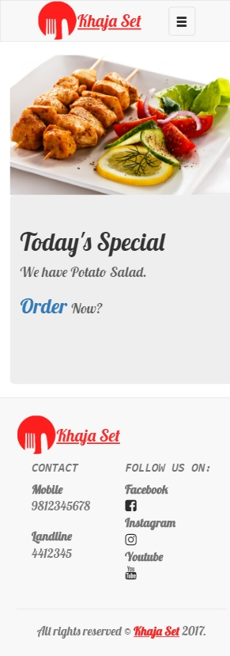
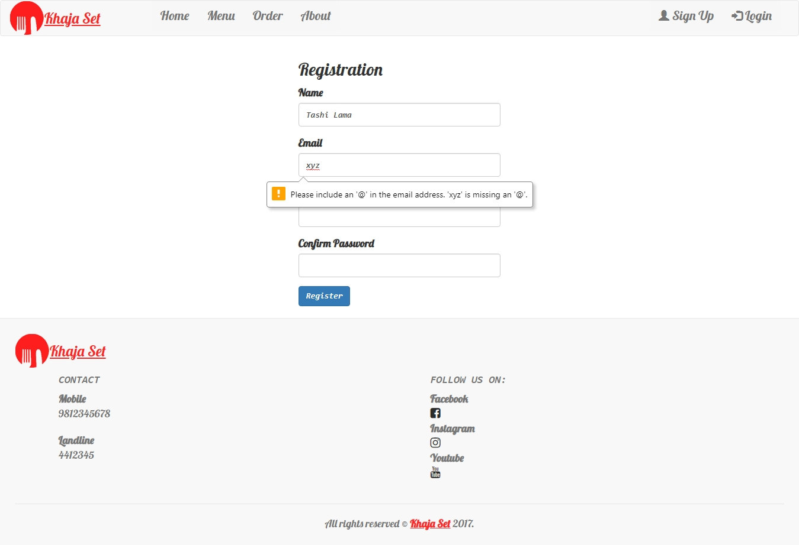
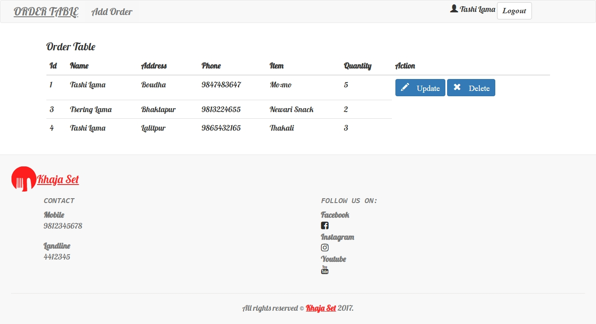

# Khaja Set
* Online food ordering portal

## Languages Implemented
* HTML 5
* CSS 3
* Bootstrap 4
* PHP
* MySql

## Features 
* Dynamic
* Responsive design
* HTML5 Validation
* Session functionality
* CRUD functionality

## Screenshots
### 1. FrontPage
* Desktop View

* Mobile View  

### 2. Registration

### 3. Order table
